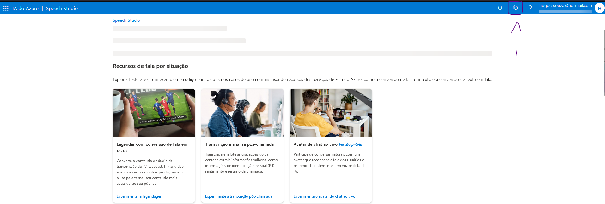
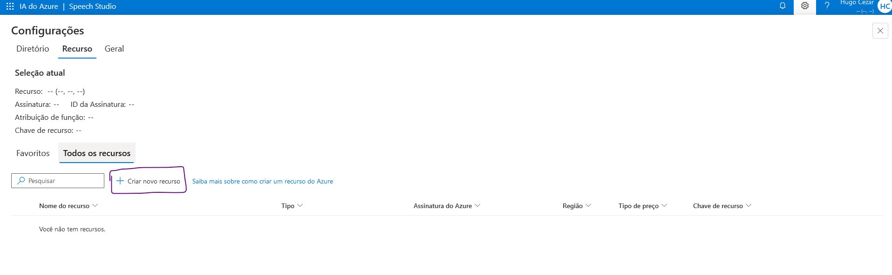
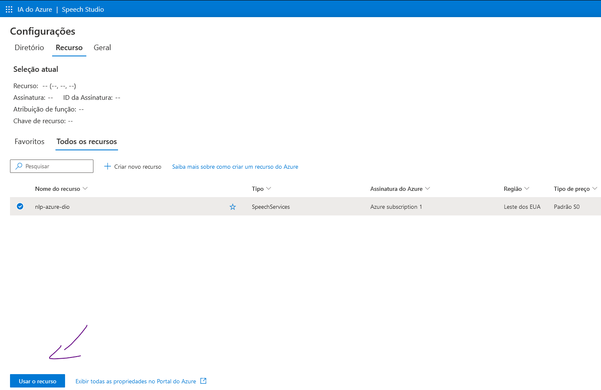
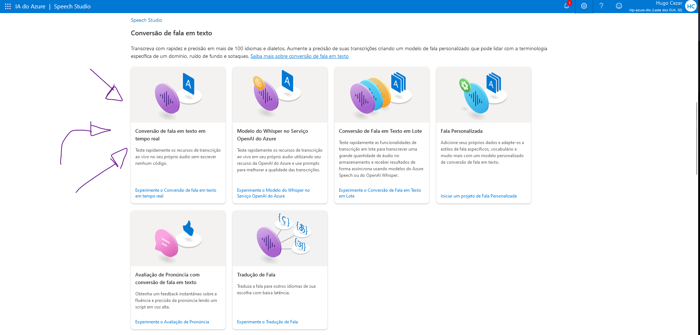

# Utilização de recursos de linguagem natural dentro do Azure
Caso seja sua primeira interação com o ambiente Azure, recomendo visitar primeiro [este repositório](https://github.com/HugoCSouza/inicio-azure) que indica os passos iniciais de configuração de um ambiente Azure.

## Introdução ao Speech Studio
Para trabalhar com NLP dentro do Azure, começaremos pelo o Speech Studio que está disponível neste [link](https://speech.microsoft.com/portal). Logue com sua conta Azure, e você já terá acesso ás ferramentas.

### Criar um novo recurso
Dentro da página inicial, clique no ícone da engrenagem. Ela te levará a aba de configurações.

Dentro dessa aba, clique em criar um novo recurso. Crie este novo recurso preenchendo as lacunas.

Selecione o novo recurso e clique em usar o recurso. Você será redirecionado a página principal.

Na página principal, desca a página até aparece a aba "**conversão de fala em texto**". Dentro dessa aba, selecione a opção "*conversão de fala em texto em tempo real*".
