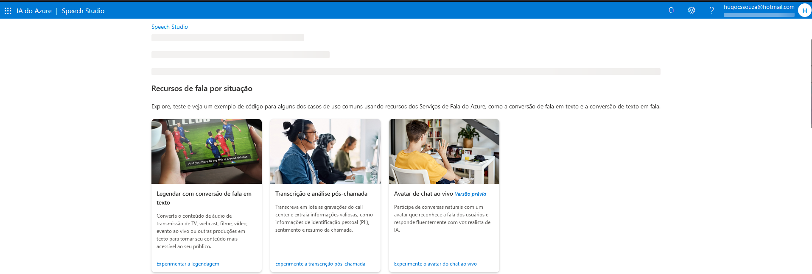

# Utilização de recursos de linguagem natural dentro do Azure
Caso seja sua primeira interação com o ambiente Azure, recomendo visitar primeiro [este repositório](https://github.com/HugoCSouza/inicio-azure) que indica os passos iniciais de configuração de um ambiente Azure.

## Introdução ao Speech Studio
Para trabalhar com NLP dentro do Azure, começaremos pelo o Speech Studio que está disponível neste [link](https://speech.microsoft.com/portal). Logue com sua conta Azure, e você já terá acesso ás ferramentas.
