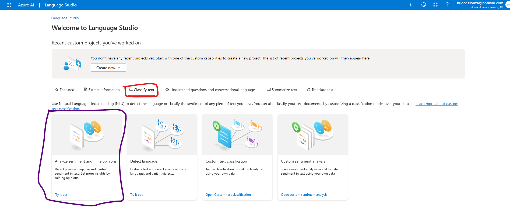

# Utilização de recursos de linguagem natural dentro do Azure
Caso seja sua primeira interação com o ambiente Azure, recomendo visitar primeiro [este repositório](https://github.com/HugoCSouza/inicio-azure) que indica os passos iniciais de configuração de um ambiente Azure.

## Introdução ao Speech Studio
Para trabalhar com NLP dentro do Azure, começaremos pelo o Speech Studio que está disponível neste [link](https://speech.microsoft.com/portal). Logue com sua conta Azure, e você já terá acesso ás ferramentas.

### Criar um novo recurso
Dentro da página inicial, clique no ícone da engrenagem. Ela te levará a aba de configurações.

Dentro dessa aba, clique em **'Criar um novo recurso'** e siga as instruções para configurar o novo recurso. Preencha os campos obrigatórios e selecione as opções relevantes conforme necessário.

Selecione o novo recurso e clique em usar o recurso. Você será redirecionado a página principal.

### Fala em texto

Na página principal, desca a página até aparece a aba "**conversão de fala em texto**". Dentro dessa aba, selecione a opção "*conversão de fala em texto em tempo real*".

Na pagina que abrir, marque a caixa de seleção que você reconhece o recurso conforme indica a seta roxa. Depois, escolha na caixa de seleção indicada pela seta verde, o idioma do áudio. Na caixa indicada pela seta vermelha, você seleciona o arquivo de aúdio que pode ser direto do seu computador ou gravar com um microfone no momento. Por fim, na seta azul, a sua resposta em formato JSON ou apenas texto.

Para demonstrar o uso da ferramenta, pedi a pessoas próximas que me mandassem áudios com assuntos diversos, com no máximo um minuto de duração. Os áudios estão dispostos dentro da pasta inputs e a saída da transcrição de cada áudio está disponível na pasta outputs com o nome do arquivo sendo: "saida-"nome das pessoas que enviaram o áudio.

## Language Studio

### Criando um recurso
Para utilizarmos o processamento de linguagem natural para utilizarmos ferramentas como análise de sentimentos, precissamos de outro tipo de recursos e IAs focada mais nesse tipo de análise de linguagem natural. Para fazermos isto no ambiente Azure, utilizaremos o Languague Studio. Para isto, começaremos inicializiando um novo recurso, diferente do utilizando anteriormente. 

Então, na [página inicial do Azure](https://portal.azure.com/#home), clique na opção de criar recursos e, dentro da aba IA + Machine Learning (destacado em roxo), selecione a opção Análise de texto (destacado em verde).

Aparecerá os recursos que voce pode selecionar a mais. Por padrão, pode-se deixar todos selecionados e clicar em *Continue to create your resource*.

Coloque as informações assim como no item Speech Studio, informando o nome a região e o tipo de preço e a caixa de uso responsável (os padrões são conforme a imagem). Clique em Examinar + Criar e espere a validação. Se tudo estiver certo, clique em criar.

Aguarde a criação do recurso e partiremos para o próximo passo.

### Language Studio
Então, vá para o [language studio](https://language.cognitive.azure.com/home). Entre na sua conta e a janela abaixo será apresentada. Deixe o resource type como language.

Selecione a opção de classificação de texto (*Classify text*), destacado em vermelho, e selecione o modelo de classficação de mineração e análise de sentimentos (*Analyze sentiment and mine opinions*), destacado em roxo.

Selecione a lingua do texto no qual você irá utilizar no campo *Select text language*, indicado pela seta vermelha. O texto é colado dentro do campo indicado pela seta amarela, ou faça o upload de um texto clicando onde está indicado na seta cinza. E selecione a caixa indicada pela seta verde. 

Rolando a página para baixo, é apresentado o botão de rodar a ferramenta e a caixa de saída.

Para testar a ferramenta, foi utilizada a [análise do Samsung Galaxy S22](https://canaltech.com.br/produto/samsung/galaxy-s22/analise/) na seção vale a pena, a [pesquisa recente sobre a aprovação do governo](https://g1.globo.com/politica/noticia/2024/03/21/datafolha-comparacao-governo-lula-outros-presidentes.ghtml) e a [carta aberta do Rei pelé sobre o final da copa do mundo de 2022.](https://www.poder360.com.br/esportes/final-da-copa-foi-espetaculo-ao-futuro-do-futebol-diz-pele/). As respostas das análises de sentimentos estão disponíveis, respectivamente, nos arquivos [Galaxy](outputs/saida-galaxys22.json), [Governo](outputs/saida-galaxys22.json) e [Rei pelé](outputs/saida-carta-pele.json).
